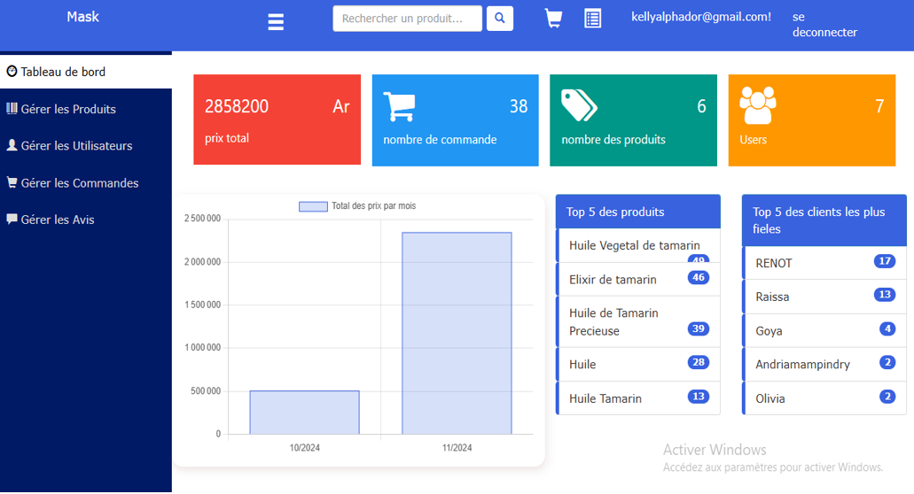
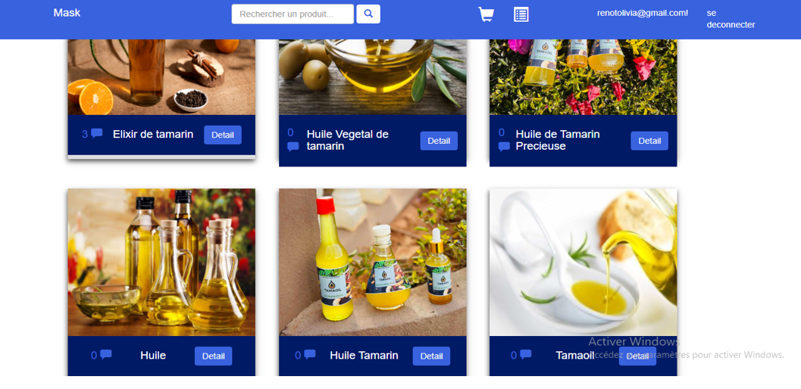
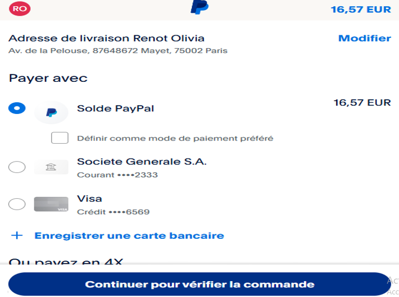

# 🛒 Application E-commerce ASP.NET MVC

## 📄 Description

Ce projet est une application e-commerce développée en **ASP.NET MVC (.NET Framework 4.8)**.  
Il permet aux utilisateurs de consulter et acheter des produits en ligne, gérer leur compte, leurs commandes, et bien plus.  

---

## 💡 Fonctionnalités principales

✅ Consulter les catalogues de produits  
✅ Rechercher des produits  
✅ Voir le détail d’un produit  
✅ Visualiser la facture d'une commande  
✅ Créer un compte  
✅ S'authentifier (avec **ASP.NET Identity**)  
✅ Gérer le panier  
✅ Passer une commande  
✅ Payer une commande (**Paypal**)  
✅ Consulter l'historique des commandes  
✅ Gérer les utilisateurs (admin)  
✅ Gérer les avis sur les produits  
✅ Gérer les produits (admin)  
✅ Gérer les commandes (admin)  
✅ Gérer les rapports de vente (admin)

---

## 🧰 Technologies utilisées

- **ASP.NET MVC** (.NET Framework 4.8)
- **ASP.NET Identity** pour l'authentification et la gestion des utilisateurs
- **SQL Server** (Database First)
- **Entity Framework**
- **Paypal API** pour le paiement en ligne
- **Bootstrap** (pour le design)

---

## 💻 Prérequis

- Visual Studio 2019 ou plus récent
- SQL Server (ou SQL Server Express)
- .NET Framework 4.8
- Un compte Paypal Sandbox (pour tester les paiements)

---

## 🖼️ Captures d'écran

### Tableau de bord (Admin)

### Page d'accueil

### Panier

### Paiement Paypal

### Paiement réussi

